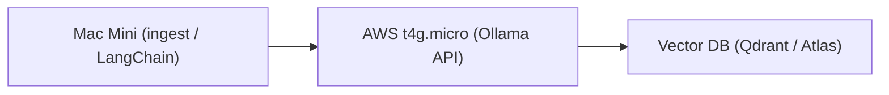

# Ollama on AWS EC2 (t4g.micro)

Deploy [Ollama](https://ollama.com) to a cheap AWS EC2 **t4g.micro** (ARM64) instance via GitHub Actions. Exposes **embeddings** (`qllama/bge-small-en-v1.5`) and light **inference** (`tinyllama`) over HTTP for RAG backends (Qdrant, FAISS, Atlas, etc.).

## Architecture



- **Mac Mini:** Ingest, LangChain, or other clients send embedding/generate requests.
- **EC2:** Runs Ollama with `OLLAMA_HOST=0.0.0.0:11434`; serves `/api/embeddings` and `/api/generate`.
- **Vector DB:** Store and query vectors produced by the embedding model.

## One-time setup

### 1. GitHub Secrets

In the repo: **Settings → Secrets and variables → Actions**, add:

| Secret        | Value                |
|---------------|----------------------|
| `EC2_HOST`    | Your EC2 public IP   |
| `EC2_USER`    | `ubuntu`             |
| `EC2_SSH_KEY` | Full contents of your `.pem` file |

### 2. EC2 security group

Allow inbound TCP on port **11434** from your IP only (for safety):

- Type: Custom TCP  
- Port: 11434  
- Source: My IP (or a specific CIDR)

## Deploy

- **Automatic:** Push to the `main` branch → workflow runs and deploys to EC2.
- **Manual:** Actions → “Deploy Ollama (bge-small) to EC2” → “Run workflow”.

The workflow will:

1. Install dependencies and Ollama (if missing).
2. Configure Ollama to listen on `0.0.0.0:11434`.
3. Pull `qllama/bge-small-en-v1.5` and `tinyllama`.
4. Restart the service and run a local health check.

## Test from your Mac

Replace `EC2_IP` with your instance’s public IP.

**Embeddings (384-dim vector):**

```bash
curl http://EC2_IP:11434/api/embeddings -d '{
  "model": "qllama/bge-small-en-v1.5",
  "prompt": "AWS ollama test"
}'
```

**Light inference (optional):**

```bash
curl http://EC2_IP:11434/api/generate -d '{
  "model": "tinyllama",
  "prompt": "hello"
}'
```

## Scope and limits (t4g.micro)

This setup is for:

- Embedding workloads (`qllama/bge-small-en-v1.5`).
- Light orchestration and dev/testing.
- A stable, cheap RAG backend (~$5/month).

Do **not** use this instance for:

- Large inference (e.g. llama3).
- vLLM or other GPU-heavy stacks.

Use a GPU instance for those later.

## Next steps (optional)

- **Auto-shutdown at night** to reduce cost.
- **Nginx (or similar) in front** for TLS and auth.
- **Terraform** to manage EC2 and security groups.
- **LangChain** (or other client) configured to call this embedding endpoint.
