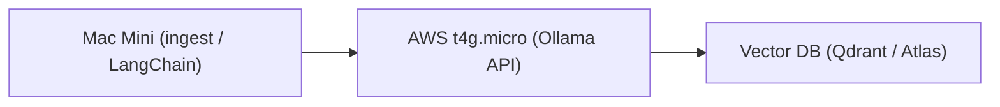

# Ollama on AWS EC2 (t4g.micro)

Deploy [Ollama](https://ollama.com) to a cheap AWS EC2 **t4g.micro** (ARM64) instance via GitHub Actions. Exposes **embeddings** (`qllama/bge-small-en-v1.5`) and light **inference** (`tinyllama`) over HTTP for RAG backends (Qdrant, FAISS, Atlas, etc.).

## Architecture



- **Mac Mini:** Ingest, LangChain, or other clients send embedding/generate requests.
- **EC2:** Runs Ollama with `OLLAMA_HOST=0.0.0.0:11434`; serves `/api/embeddings` and `/api/generate`.
- **Vector DB:** Store and query vectors produced by the embedding model.

## One-time setup

### 1. GitHub Secrets

**Settings → Secrets and variables → Actions → Secrets:**

| Secret                  | Value                  |
|-------------------------|------------------------|
| `AWS_ACCESS_KEY_ID`     | IAM access key         |
| `AWS_SECRET_ACCESS_KEY` | IAM secret key         |
| `EC2_SSH_KEY`           | Full contents of `.pem` |

### 2. EC2 security group

Create a security group (e.g. `ec2`) with inbound rules:

- **SSH** (22) from `0.0.0.0/0`
- **Custom TCP** (11434) from your IP or `0.0.0.0/0`

### 3. AWS key pair

Create a key pair (e.g. `ec2`) and add the private key to `EC2_SSH_KEY`.

## Deploy

- **Automatic:** Push to `qa` → workflow finds or creates EC2, then deploys.
- **Manual:** Actions → “Deploy Ollama (bge-small) to EC2” → “Run workflow”.

The workflow will:

1. Find existing instance (tag `ec2-cpu-ollama`) or create a new t4g.micro.
2. SSH in, install Ollama, configure `0.0.0.0:11434`.
3. Pull `qllama/bge-small-en-v1.5` and `tinyllama`.

## Test from your Mac

Replace `EC2_IP` with your instance’s public IP.

**Embeddings (384-dim vector):**

```bash
curl http://EC2_IP:11434/api/embeddings -d '{
  "model": "qllama/bge-small-en-v1.5",
  "prompt": "AWS ollama test"
}'
```

**Light inference (optional):**

```bash
curl http://EC2_IP:11434/api/generate -d '{
  "model": "tinyllama",
  "prompt": "hello"
}'
```

## Scope and limits (t4g.micro)

This setup is for:

- Embedding workloads (`qllama/bge-small-en-v1.5`).
- Light orchestration and dev/testing.
- A stable, cheap RAG backend (~$5/month).

Do **not** use this instance for:

- Large inference (e.g. llama3).
- vLLM or other GPU-heavy stacks.

Use a GPU instance for those later.

## Next steps (optional)

- **Auto-shutdown at night** to reduce cost.
- **Nginx (or similar) in front** for TLS and auth.
- **Terraform** to manage EC2 and security groups.
- **LangChain** (or other client) configured to call this embedding endpoint.
